**Работа с удаленными репозиториями и GitHub**

**Цель работы**

Освоить основные навыки работы с облачными и распределенными системами контроля версий, получить навыки работы с инструментальными средствами, обеспечивающими командную работу над разработкой ПО.

**Задания для выполнения**

1. Зарегистрироваться на сайте github.com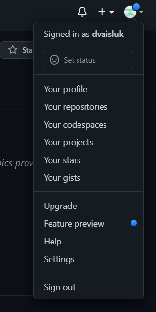
1. Установить на компьютере программу Git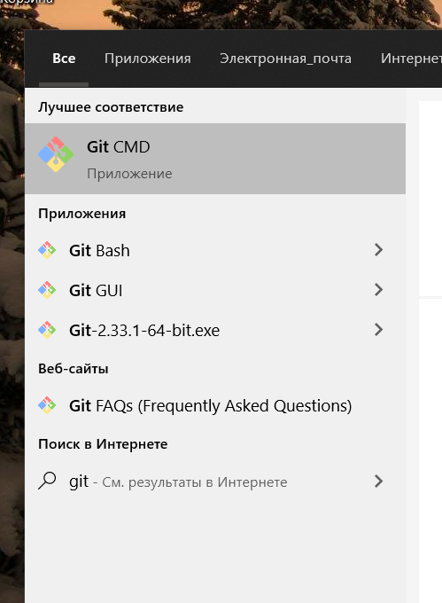

1. Форкнуть данный репозиторий в свой аккаунт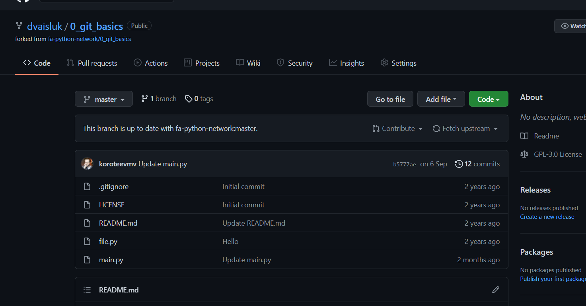
1. Склонировать созданный удаленный репозиторий в директорию ~/git/test 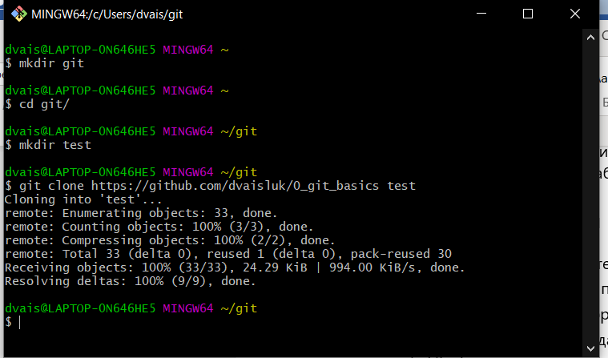
1. На локальной машине пишем скрипт ~/git/test/backup.sh, с произвольным содержанием 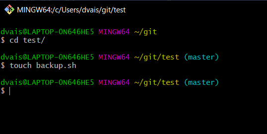

1. Фиксируем скрипт в репозитории (делаем коммит) 

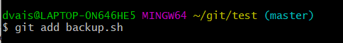

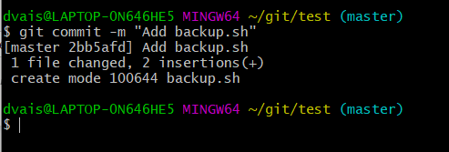

1. Обновляем удаленный репозиторий репозиторий (делаем пуш) 

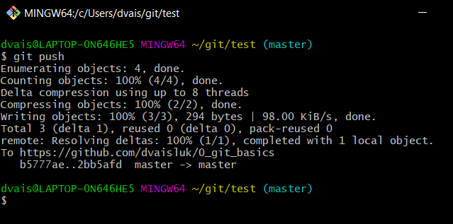

1. Через текстовый редактор добавить любую новую строку с комментарием 

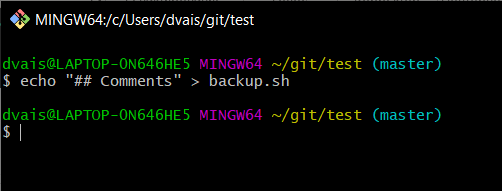

1. Сделать коммит 

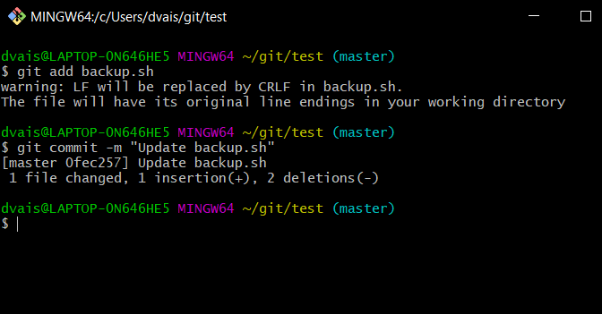

1. Внести синтаксическую ошибку в скрипт 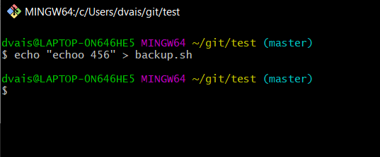
1. Сделать коммит ошибочного скрипта 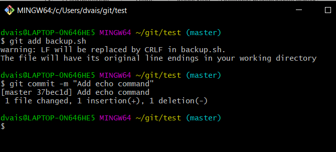
1. Откатываем до последней рабочей версии 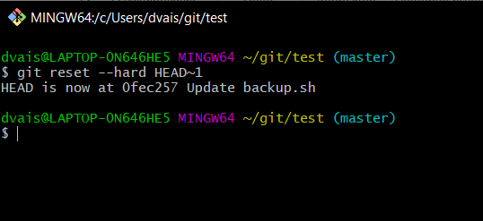
1. Просмотреть историю коммитов 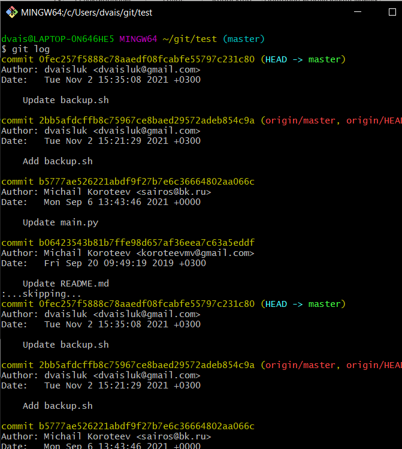
1. Добавить несколько коммитов произвольного содержимого 

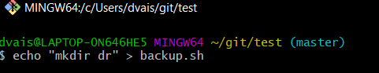

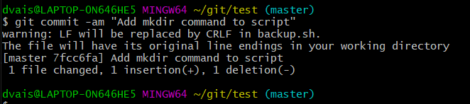

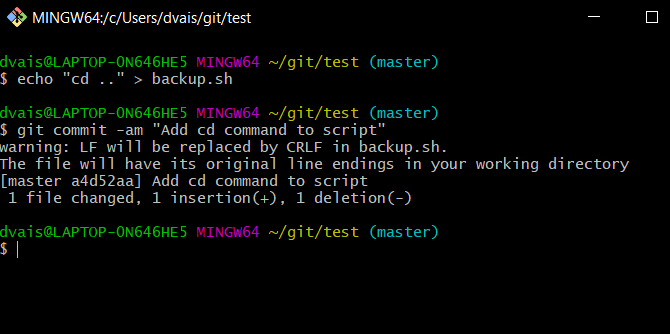

1. Создать пулл реквест в данный репозиторий 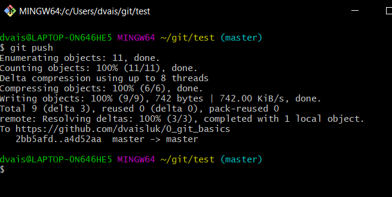

**Контрольные вопросы**

1. Зачем нужен облачный хостинг репозиториев?

Облачный хостинг репозиториев нужен для того, чтобы к репозиторию могли иметь доступ сразу несколько разработчиков вне зависимости от того, включена физическая машина с данными репозитория или нет

2. Какими основными функциями обладает сайт github.com?

С помощью сайта github.com можно загружать репозитории, клонировать, делать ответвления для тестирования, делиться репозиторием.

3. Как организовать командную работу над открытым проектом?

Из корневого репозитория разработчики независимо друг от друга могут делать ответвления в свой профиль и работать над определенной частью проекта, после чего отправить отредактированную копию репозитория для дальнейшего слияния/отладки.

